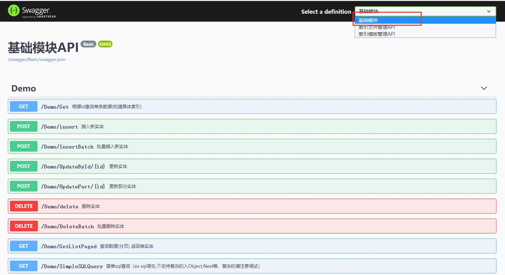
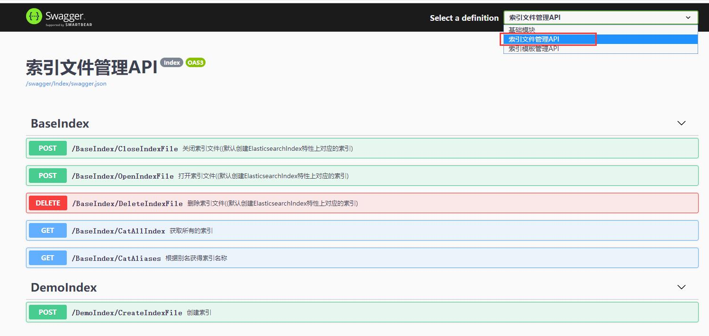
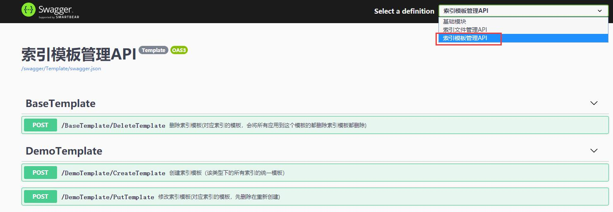
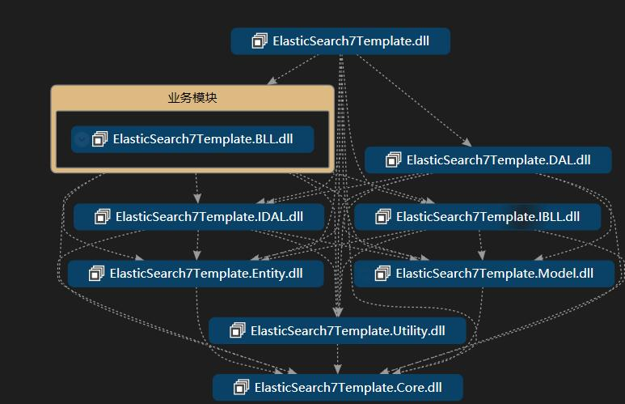

# ElasticSearch7Template 
 该项目为ElasticSearch的webapi项目， 基于.NET CORE 3.1 和NEST  7.2.1，低于7.X的，请自行改写DAL层即可，
 项目面向接口编程，鉴于es数据逻辑一般不会太复杂，简化了整个项目，项目中使用Scrutor自动扫描注入
 

1. 数据接口api：
 
1. 索引接口api

1. 模板接口api

## 项目约定 ##
方便理解整个项目的情况，项目中基于一些约定，约定大于配置，违反该约定可能会出错
  

1. 服务实现类统一命名方式:XXXServiceImpl
2. 服务接口统一命名方式：IXXXService
3. 实体统一命名方式：XXXEntity
4. 条件查询统一命名方式：BaseXXXCondition
5. DAL实现类统一命名方式:XXXRepositoryImpl
6. IDAL接口统一命名方式：IXXXRepository
7. 索引对应的默认名称，别名，模板名称，统一在实体DemoEntity的特性上设置如下：
	1. [ElasticsearchIndex(DefaultIndexName = "demo", Alias = "demo_alias", TemplateName = "demo_template")]
	2. [ElasticsearchType(RelationName = "_doc", IdProperty = "id")]
3. 项目根据模块分组，api同时也根据模板分组，不分组可能会出现api swagger不展示
  
##  项目结构 ##
ElasticSearch7Template
   

- .template.config  （.NET CORE 脚手架模板）
- .editorconfig （代码规范文件,可删除，不影响使用）
- ElasticSearch7Template （api）
- ElasticSearch7Template.BLL (业务逻辑)
- ElasticSearch7Template.BLL.MediatR （业务逻辑中介通用层基于MediatR，此处暂时没用到）
- ElasticSearch7Template.Core（公共核心类）
- ElasticSearch7Template.DAL （仓储层)
- ElasticSearch7Template.Entity(实体)
- ElasticSearch7Template.IBLL （业务接口）
- ElasticSearch7Template.IDAL （仓储接口）
- ElasticSearch7Template.Model （model层）
- ElasticSearch7Template.Utility （工具类）

项目依赖关系如下：上层依赖下层，细节依赖抽象。

## 项目结构说明 ##
 项目包含一个demo例子。

1. 类的命名，api的实际编写其实基于表结构自动生成，如表名demo
	1. ibll接口为 
		1. IQueryDemoService 包含增删改
		2. ICommandDemoService,只包含包含查询
	2. bll接口实现为 （统一后缀Impl）
		1. QueryDemoServiceImpl 包含增删改
		2. CommandDemoServiceImpl,只包含包含查询
	3. IDAL接口为：
		1. IDemoRepository
	4. DAL接口实现为:
		1. DemoRepositoryImpl
	5. Model对应的查询条件类为：
		1. BaseDemoCondition
	6. Entity对应的类：
		1. DemoEntity
		2. PartOfDemoEntity 
	7. controller对应的类为：
		1. DemoController  es数据接口controller
		2. DemoIndexController es索引文件接口controller
		3. DemoTemplateController es模板文件接口controller
4. 依赖注入：项目中使用Scrutor自动扫描注入（详情见Core项目IAutoInject，api项目下RegisterService文件），以下为瞄点
	1. IAutoInject，IScopedAutoInject   自动注入扫描点默认为Scoped 
	3. ISingletonAutoInject 自动注入接口和实现Singleton类型
	4. ITransientAutoInject 自动注入接口和实现Transient类型
	5. ISelfScopedAutoInject 自动注入自身Scoped类型
	6. ISelfSingletonAutoInject 自动注入自身Singleton类型
	7. ISelfTransientAutoInject 自动注入自身Transient类型

## 下载安装 ##
项目配备了dotnet cli的模板功能，可以直接安装进行替换，省去修改命名空间等繁琐操作，详情了解.template.config 文件，
 

1. 下载后，进入目录，和（.template.config同级）

1. 运行 dotnet new -i . (-i 后面有个 点“.”) 安装模板

1. 安装成功后运行dotnet new，可看见安装的模板 myesapi 
2. 进入项目目录 dotnet new myesapi XXX，创建新的es api项目
	1.  XXX 为你的项目名称，如  dotnet new myesapi test,会创建一个项目目录test，内部包含，整个项目的源码
	2. ElasticSearch7Template  会被全局替换为test，包括文件夹的名称
3. 修改appsettings下的ElasticSearchConfig得 ClusterNodeUrlHosts值配置es
5. dotnet build 或者dotnet run 即可

## 代码生成器使用 ##
### 注意：表必须有主键，不支持联合主键  ###

目前只支持从SqlServer生成，其他库暂无支持
1. 安装, 下载地址：链接：https://pan.baidu.com/s/1ZpfDX8igJ6xOu3z_f_U7pg 
提取码：6yr0 
2. 登陆
3.左侧选择数据库，

1.  选择表名右击：
  
   
1. 命名空间前缀：
	1. 替换ElasticSearch7Template，项目名称如test1
1. 模块名称
	1. 简单项目可不填默认模块名称basic
	2. ，如果业务复杂拆分多个BLL项目，如test.bll.user,此处填写user即可，bll，ibll会对应生成到test.bll.user,test.Ibll.user文件夹中
	3. 也可以不拆分多个项目，只在BLL下拆成多个文件夹，下面是否拆分bll不勾选即可
2. 实体
	1. 实体名称，不带entity，如，输入demo，实际生成的为demoEntity
3. 平台类型
	1. 选ELASTICSEARCH,
4. 工作目录
	1. 项目目录
5. 是否拆分BLL
	1. 如果不存在多个BLL项目，此处不勾选即可
6. 是否生成控制器代码
	1. 生成controller，如果不希望对外公开接口，不勾选即可

生成完成后，直接运行即可``
## 说明 ##

1. editorconfig 为代码规范文件，各人不一样，我个人采用比较强制的规范，不符合会报错，可以直接删除。
2. api 只是初级版，针对es中的复杂场景，请自行拓展。
2. 项目提供了基于sql的查询SimpleSQLQuery查询，请自行根据es的语法编写，针对Object，Nested 类型没有提供支持。
3. 代码生成器，部分功能不属于elasticsearch，属于另外个模板项目，请不要超出上述的使用方式，可能生成的代码会报错，个人暂时不会去修改这个。
4. GenerateCode.rar 代码生成器包，下载安装即可，基于.NET Framework 4.6.1。
5. 代码可能存在bug，请提交pr，thanks。
## 演示地址 ##

## 路线图 ##
  暂时没有 -_-

## 交流群 ##

## LICENSE ##
MIT

    
 
